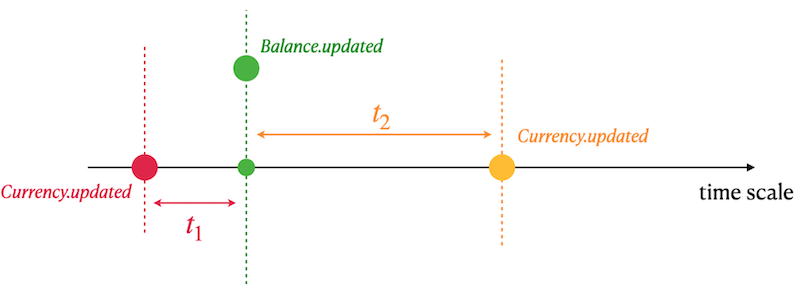

# Team 01 - Piscine SQL

## _Data Warehouse_

Resume: Today you will know what DWH is and how to create a first ETL process

## Exercise 01 - Detailed Query

| Exercise 01: Detailed Query|                                                                                                                          |
|---------------------------------------|--------------------------------------------------------------------------------------------------------------------------|
| Turn-in directory                     | ex01                                                                                                                     |
| Files to turn-in                      | `team01_ex01.sql`                                                                             |
| **Allowed**                               |                                                                                                                          |
| Language                        | ANSI SQL|

Before deeper diving into this task please apply INSERTs statements below.

`insert into currency values (100, 'EUR', 0.85, '2022-01-01 13:29');`
`insert into currency values (100, 'EUR', 0.79, '2022-01-08 13:29');`

Please write a SQL statement that returns all Users , all Balance transactions (in this task please ignore currencies that do not have a key in the `Currency` table ) with currency name and calculated value of currency in USD for the nearest day.

Below presented a table of result columns and corresponding calculation formula.

| Output Column | Formula (pseudocode) |
| ------ | ------ |
| name | source: user.name if user.name is NULL then return `not defined` value |
| lastname | source: user.lastname if user.lastname is NULL then return `not defined` value |
| currency_name | source: currency.name | 
| currency_in_usd | involved sources: currency.rate_to_usd, currency.updated, balance.updated.Take a look at a graphical interpretation of the formula below.| 

- need to find a nearest rate_to_usd of currency at the past (t1) 
- if t1 is empty (means no any rates at the past) then find a nearest rate_to_usd of currency at the future (t2)
- use t1 OR t2 rate to calculate a currency in USD format

Please take a look at a sample of output data below. Sort the result by user name in descending mode and then by user lastname and currency name in ascending mode.

| name | lastname | currency_name | currency_in_usd |
| ------ | ------ | ------ | ------ |
| Иван | Иванов | EUR | 150.1 |
| Иван | Иванов | EUR | 17 |
| ... | ... | ... | ... |

